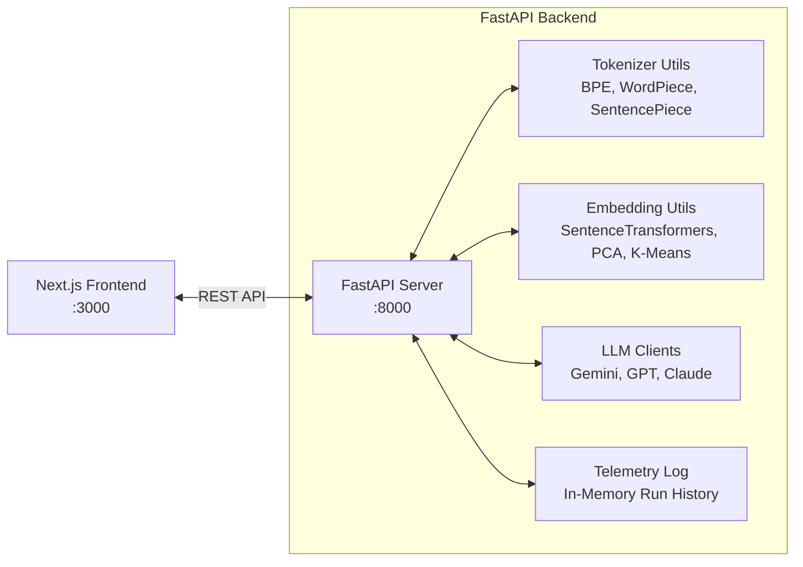

# LLM Playground Studio

LLM Playground Studio is an educational and experimental suite built to explore, analyze, and compare the core mechanics of Large Language Models (LLMs). The project utilizes a decoupled architecture consisting of a **Python FastAPI backend** executing local ML computations & LLM client queries, and a **Next.js (React) frontend** providing an interactive telemetry dashboard.

---

## 🚀 Architectural Overview



### 1. Backend Core (Python & Local ML)
The backend manages all CPU/GPU heavy computations, including subword parsing, vector generations, similarity matrix math, and dimensionality reduction projections:
*   **Tokenizers:** Local tokenizer loaders for **GPT** (`tiktoken` / BPE), **BERT** (`transformers.AutoTokenizer` / WordPiece), and **SentencePiece** (`t5-small` / Unigram).
*   **Embeddings:** Local vector generation using Hugging Face's `sentence-transformers` (supporting `all-MiniLM-L6-v2`, `all-mpnet-base-v2`, and multilingual variants).
*   **Dimensionality Reduction:** Uses `scikit-learn` to project high-dimensional embeddings (384 or 768 dimensions) down to 2D coordinates using **PCA (Principal Component Analysis)** and **t-SNE** for scatter plot visualizations.
*   **Semantic Clustering:** Implements **K-Means Clustering** to segment text representations into distinct clusters based on vector distances.
*   **Vector Similarities:** Calculates pairwise similarity tables and rankings via **Cosine Similarity** metrics.

### 2. Multi-Provider LLM Clients
Connects directly to major LLM providers to fetch generations and performance statistics:
*   **Google Gemini Client:** Utilizes the modern `google-genai` SDK to query `gemini-2.5-flash`.
*   **OpenAI Client:** Utilizes the `openai` SDK to query `gpt-4o-mini`.
*   **Anthropic Claude Client:** Utilizes the `anthropic` SDK to query `claude-3-5-sonnet-latest`.
*   **API Telemetry:** Tracks latency speeds, input prompt lengths, response word counts, and character volumes.
*   **Simulated Demo Mode:** Includes mock fallbacks for all three LLM clients, allowing developer demonstrations without active API keys or offline.

### 3. Frontend Client Interface (Overview)
*   An interactive client web interface built with **Next.js App Router**, **TypeScript**, and **TailwindCSS**.
*   Implements customized Recharts widgets for latency distributions, subword length checks, and prompt strategies.
*   Maintains global simulation states via React Context and connects to the FastAPI backend using a centralized API utility.

---

## 🛠️ API Reference (FastAPI Backend)

The backend server exposes the following REST endpoints:

| Endpoint | Method | Payload Schema | Description |
| :--- | :--- | :--- | :--- |
| `/api/chat` | `POST` | `{ prompt, simulate }` | Generates a response from Gemini and records execution logs. |
| `/api/prompt-lab` | `POST` | `{ question, strategy, simulate }` | Renders prompt engineering templates (Normal, Zero-Shot, Few-Shot, CoT) and fetches results. |
| `/api/tokenize` | `POST` | `{ text, tokenizer_type, model_name, include_special_tokens }` | Tokenizes text and returns subword lists, integer IDs, and length/efficiency metrics. |
| `/api/embeddings` | `POST` | `{ sentences, model_name, dim_algo, enable_cluster, n_clusters }` | Generates text vectors, similarity matrix heatmaps, K-Means clusters, and 2D scatter coordinates. |
| `/api/semantic-search` | `POST` | `{ query, sentences, model_name }` | Embeds a search query and ranks the sentences by cosine similarity. |
| `/api/compare` | `POST` | `{ prompt, simulate }` | Queries Gemini, OpenAI, and Claude concurrently, returning comparative latency and text results. |
| `/api/analytics` | `GET` | *None* | Returns the run telemetry history array. |
| `/api/analytics/prefill` | `POST` | *None* | Prefills the log database with 30 mock records for demonstration. |
| `/api/analytics/reset` | `POST` | *None* | Clears all telemetry records in the current session. |

---

## 💻 Getting Started

### Prerequisites
*   Python 3.10+
*   Node.js 18+ and npm

### 1. Backend Server Setup
Navigate to the root directory, configure the environment, install the Python packages, and launch the API server:

```bash
# Activate your virtual environment (Windows Powershell example)
.\.venv\Scripts\Activate.ps1

# Install packages
pip install -r backend/requirements.txt

# Create your backend .env file (if not present) and add API keys:
# GEMINI_API_KEY=your_key
# OPENAI_API_KEY=your_key
# ANTHROPIC_API_KEY=your_key

# Run the FastAPI server via Uvicorn
python -m uvicorn backend.main:app --host 0.0.0.0 --port 8000
```
*The interactive API Swagger docs will be available at:* **[http://localhost:8000/docs](http://localhost:8000/docs)**

### 2. Frontend client Setup
Open a separate terminal window and start the Next.js development server:

```bash
# Navigate to frontend folder
cd frontend

# Install package dependencies
npm install --legacy-peer-deps

# Start Next.js dev server
npm run dev
```
*The React Dashboard will be live at:* **[http://localhost:3000](http://localhost:3000)**
