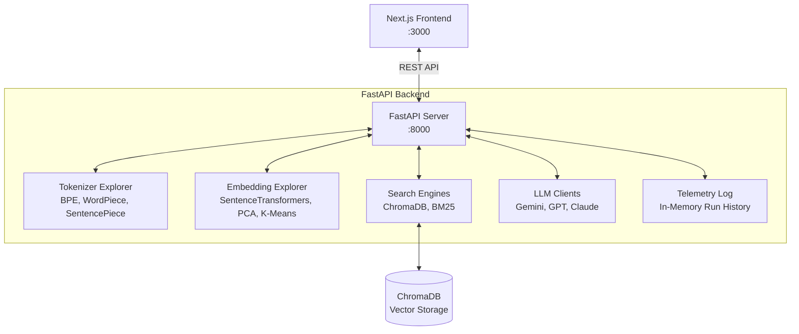

# LLM Playground Studio

[](https://www.python.org/downloads/)
[](https://nextjs.org/)
[](https://fastapi.tiangolo.com/)
[](https://www.trychroma.com/)
[](LICENSE)

LLM Playground Studio is an educational and benchmarking suite designed to explore, analyze, and compare the core mechanics of Large Language Models (LLMs) and advanced information retrieval (RAG) architectures. The application decouples local machine learning computations and vector operations (Python FastAPI) from user controls and visualizations (Next.js & TailwindCSS).

---

## 🚀 Architectural Overview



For a detailed breakdown of the components, design patterns, and request execution flows, refer to the [Project Architecture Document](docs/architecture.md).

---

## ✨ Features

- **Generative AI Playground:** Run prompts, compare completions, and benchmark latencies between Google Gemini, OpenAI GPT, and Anthropic Claude models side-by-side.
- **Tokenizer Explorer:** Visualizes text tokenization using BPE, WordPiece, and SentencePiece tokenizers, displaying vocabulary IDs and statistics.
- **Embedding Explorer:** Generates text embeddings and projects them on interactive 2D charts using PCA or t-SNE, with K-Means clustering.
- **Advanced Ingestion & Chunking:** Upload documents (PDF, DOCX, TXT, MD) and configure text splitting using Fixed-Size, Semantic, or Hierarchical strategies.
- **Hybrid Search Engine:** Integrates semantic vector search (ChromaDB) and exact keyword search (BM25) using Reciprocal Rank Fusion (RRF).
- **Retrieval Benchmarking:** Side-by-side comparison of retrieved chunks from Naive, Hybrid, HyDE, and Multi-Query strategies.
- **Grounded Generation & Citations:** Run RAG queries and view source citation cards showing chunk details and similarity scores.
- **Evaluation Dashboard:** Calculates Faithfulness, Answer Relevancy, and Context Recall scores using LLM judges.
- **Simulation Sandbox Mode:** Test the application's interface locally without active API credentials.

---

## 📂 Project Structure

```
LLM-Playground-Studio/
├── backend/                       # FastAPI Backend Service
│   ├── api/                       # REST Endpoint Routers
│   ├── config/                    # Environment & Logging Settings
│   ├── core/                      # Core NLP & ML engines
│   ├── data/                      # Persistent Uploads & Metadata
│   ├── models/                    # Pydantic Request/Response validation models
│   ├── services/                  # Business Logic Wrappers
│   └── main.py                    # API Server Entry point
├── docs/                          # Architecture & Developer Manuals
└── frontend/                      # Next.js Frontend Application
```

For more details on the directories and files, refer to the [Folder Structures Guide](docs/architecture.md#4-modules--directory-structures).

---

## 💻 Getting Started

### Prerequisites
- Python 3.10 or 3.11
- Node.js 18 or 20 (with npm)

### 1. Backend Server Setup
1. Navigate to the `backend/` directory:
   ```bash
   cd backend
   ```
2. Create and activate a virtual environment:
   ```bash
   python -m venv .venv
   # Windows PowerShell
   .\.venv\Scripts\Activate.ps1
   # macOS/Linux
   source .venv/bin/activate
   ```
3. Install the dependencies:
   ```bash
   pip install -r requirements.txt
   ```
4. Create a `.env` file and add your API keys:
   ```env
   OPENAI_API_KEY=your_key_here
   GEMINI_API_KEY=your_key_here
   ANTHROPIC_API_KEY=your_key_here
   ```
5. Start the FastAPI server:
   ```bash
   python main.py
   ```
   *The API will be live at:* **[http://localhost:8000](http://localhost:8000)**  
   *Interactive Swagger documentation:* **[http://localhost:8000/docs](http://localhost:8000/docs)**

### 2. Frontend Client Setup
1. Open a new terminal and navigate to the `frontend/` directory:
   ```bash
   cd frontend
   ```
2. Install package dependencies:
   ```bash
   npm install --legacy-peer-deps
   ```
3. Start the Next.js development server:
   ```bash
   npm run dev
   ```
   *The user dashboard will be live at:* **[http://localhost:3000](http://localhost:3000)**

---

## 📊 Usage Guide

- **Live API vs. Simulation Mode:** If you do not have API keys for Gemini, OpenAI, or Claude, toggle **Simulation Mode** in the sidebar. This will bypass external network calls and use mock responses locally.
- **Uploading Test Documents:** Navigate to **Document Manager** to upload files. You can load a pre-configured sample document by clicking **Load Sample Document**.
- **Running Evaluations:** Navigate to the **RAG Playground**, enter a query, generate a response, and click **Evaluate Output** to view RAGAS-like evaluation metrics.

---

## 🗺️ Roadmap & Contributing

We are constantly working to add more features. Review our [Project Roadmap](docs/roadmap.md) to see planned enhancements.

We welcome community contributions! Please review our [Contributing Guidelines](docs/contributing.md) to learn how to propose changes, report bugs, and submit Pull Requests.

---

## 📄 License & Acknowledgements

This project is licensed under the MIT License - see the [LICENSE](LICENSE) file for details.

Special thanks to the open-source communities behind:
- **FastAPI** & **Uvicorn**
- **Next.js** & **TailwindCSS**
- **ChromaDB** & **rank_bm25**
- **Hugging Face Transformers**
