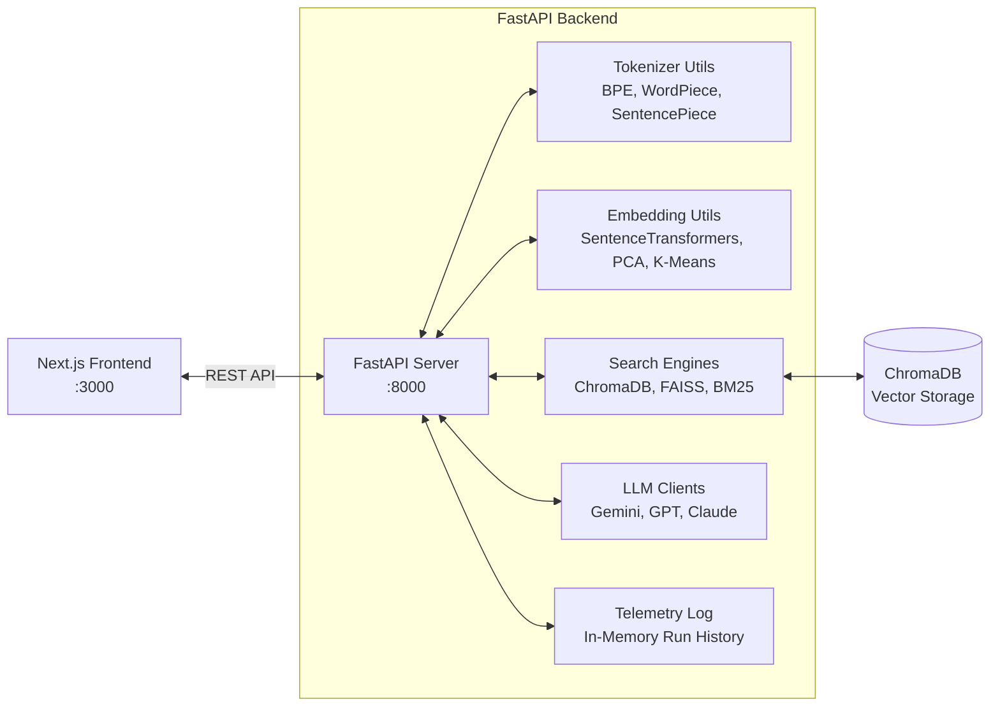

# LLM Playground Studio

LLM Playground Studio is an educational and experimental suite built to explore, analyze, and compare the core mechanics of Large Language Models (LLMs). The project utilizes a decoupled architecture consisting of a **Python FastAPI backend** executing local ML computations, vector database management, and LLM client queries, alongside a **Next.js (React) frontend** providing an interactive dashboard and search explorer.

---

## 🚀 Architectural Overview



### 1. Backend Core & Search Architecture (Python & Local ML)
The backend manages all CPU/GPU heavy computations, vector storage, and search ranking:
*   **Tokenizers:** Local tokenizer loaders for **GPT** (`tiktoken`), **BERT** (`AutoTokenizer`), and **SentencePiece** (`t5-small`).
*   **Embeddings:** Local vector generation using Hugging Face's `sentence-transformers` (e.g., `all-MiniLM-L6-v2`).
*   **Vector Databases (Semantic Search):** Utilizes **ChromaDB** for persistent semantic storage and **FAISS** for blazing-fast in-memory vector similarity searches.
*   **Lexical Search:** Implements **BM25** (`rank_bm25`) for traditional exact-keyword matching and ranking.
*   **Hybrid Search:** Merges Semantic (ChromaDB) and Lexical (BM25) search results using the mathematical **Reciprocal Rank Fusion (RRF)** algorithm to yield state-of-the-art information retrieval.
*   **Dimensionality Reduction:** Uses `scikit-learn` (PCA, t-SNE) and K-Means to project high-dimensional embeddings down to 2D coordinates for scatter plot visualization.

### 2. Multi-Provider LLM Clients
Connects directly to major LLM providers to fetch generations and performance statistics:
*   **Google Gemini Client:** Utilizes the `google-genai` SDK (`gemini-2.5-flash`).
*   **OpenAI Client:** Utilizes the `openai` SDK (`gpt-4o-mini`).
*   **Anthropic Claude Client:** Utilizes the `anthropic` SDK (`claude-3-5-sonnet-latest`).
*   **Simulated Demo Mode:** Includes mock fallbacks for all three LLM clients, allowing developer demonstrations without active API keys.

### 3. Frontend Client Interface
*   An interactive client web interface built with **Next.js App Router**, **TypeScript**, and **TailwindCSS**.
*   **Search Explorer UI:** A dedicated interactive dashboard to benchmark and compare Semantic, Keyword, and Hybrid search algorithms side-by-side.
*   Implements customized Recharts widgets for latency distributions, subword length checks, and prompt strategies.

---

## 🛠️ API Reference (FastAPI Backend)

The backend server exposes the following REST endpoints:

### Search & Vector Endpoints (Phase 2)
| Endpoint | Method | Description |
| :--- | :--- | :--- |
| `/api/embed` | `POST` | Generates mathematical embeddings for a batch of strings. |
| `/api/insert` | `POST` | Injects raw JSON documents into both ChromaDB and the BM25 index. |
| `/api/chroma` | `POST` | Performs a pure Vector Semantic Search using ChromaDB. |
| `/api/search` | `POST` | Performs a pure Lexical Keyword Search using BM25. |
| `/api/hybrid` | `POST` | Performs a Hybrid Search combining BM25 and ChromaDB using Reciprocal Rank Fusion. |

### Generative AI & Lab Endpoints (Phase 1)
| Endpoint | Method | Description |
| :--- | :--- | :--- |
| `/api/chat` | `POST` | Generates a response from Gemini and records execution logs. |
| `/api/prompt-lab` | `POST` | Renders prompt engineering templates (Zero-Shot, Few-Shot, CoT). |
| `/api/tokenize` | `POST` | Tokenizes text and returns subword lists, IDs, and length metrics. |
| `/api/embeddings` | `POST` | Generates vectors, K-Means clusters, and 2D scatter coordinates. |
| `/api/compare` | `POST` | Queries Gemini, OpenAI, and Claude concurrently for latency comparison. |
| `/api/analytics/*` | `GET/POST` | Telemetry logs (fetch, prefill mock data, reset). |

---

## 💻 Getting Started

### Prerequisites
*   Python 3.10+
*   Node.js 18+ and npm

### 1. Backend Server Setup
Navigate to the root directory, configure the environment, install the Python packages, and launch the API server:

```bash
# Activate your virtual environment (Windows Powershell example)
.\.venv\Scripts\Activate.ps1

# Install packages
pip install -r backend/requirements.txt

# Create your backend .env file (if not present) and add API keys:
# GEMINI_API_KEY=your_key
# OPENAI_API_KEY=your_key
# ANTHROPIC_API_KEY=your_key

# Run the FastAPI server via Python
cd backend
python main.py
```
*The interactive API Swagger docs will be available at:* **[http://localhost:8000/docs](http://localhost:8000/docs)**

### 2. Frontend client Setup
Open a separate terminal window and start the Next.js development server:

```bash
# Navigate to frontend folder
cd frontend

# Install package dependencies
npm install --legacy-peer-deps

# Start Next.js dev server
npm run dev
```
*The React Dashboard will be live at:* **[http://localhost:3000](http://localhost:3000)**
