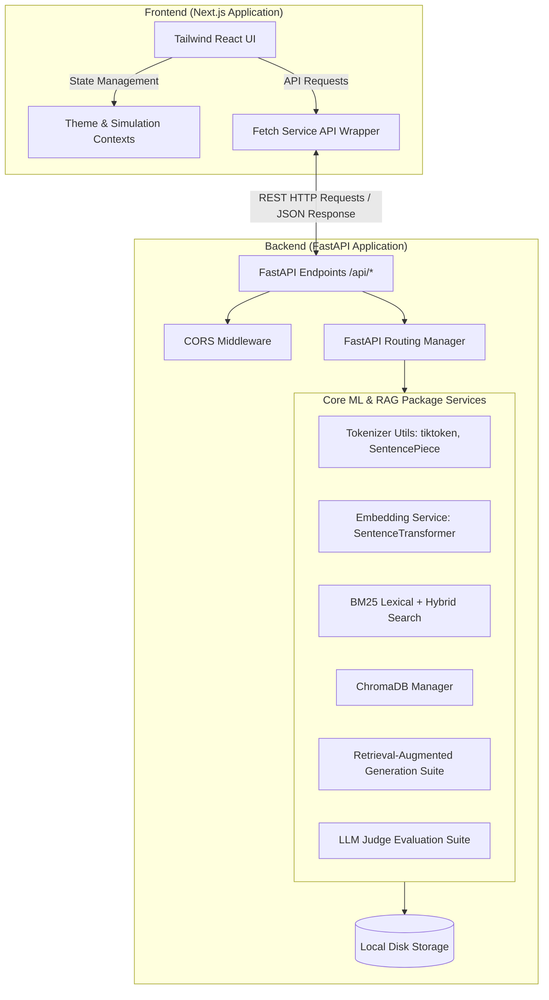
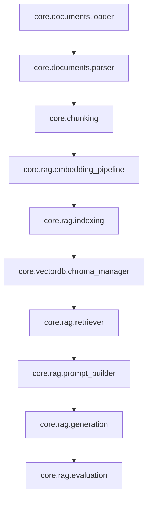
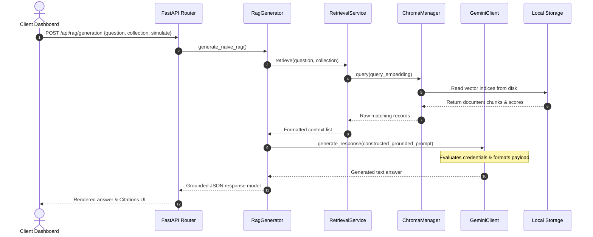

# Project Architecture

Welcome to the architectural documentation for **LLM Playground Studio**, a comprehensive educational and benchmarking suite designed to dissect, explore, and analyze the mechanics of Large Language Models (LLMs) and advanced search retrieval architectures.

---

## 1. Project Overview
LLM Playground Studio is an interactive dashboard environment built for developers, educators, and AI engineers. It demonstrates the inner workings of natural language processing pipelines, starting from subword tokenization and high-dimensional vector embeddings, to lexical search indexing, vector store management, hybrid search ranking fusion, and multi-strategy RAG (Retrieval-Augmented Generation) architectures.

---

## 2. Architecture Goals
- **Decoupled Mechanics:** Isolate heavy ML workloads and vector management (FastAPI) from UI controls (Next.js).
- **Transparency & Education:** Expose pipeline telemetry metrics (token mappings, coordinates, similarities, performance overheads) to the user interface.
- **Quota Conservation (Simulation Mode):** Provide high-fidelity simulated response modes for rate-limited API endpoints (like Google Gemini Free Tier).
- **Modular Adaptability:** Architect decoupled core packages to easily swap indexing engines (ChromaDB), prompt templates, and models.

---

## 3. High-Level Architecture

The application adopts a classic decoupled client-server architecture:



---

## 4. Modules & Directory Structures

The workspace is organized into discrete client and server projects:

```
LLM-Playground-Studio/
├── backend/                       # Python Backend Service
│   ├── api/                       # Modular FastAPI Routes
│   ├── config/                    # Logging, constants, and API key environment configurations
│   ├── core/                      # Core ML engines and pipelines
│   │   ├── chunking/              # Text splitting strategies (fixed, semantic, hierarchical)
│   │   ├── documents/             # Document parsing, loading, and metadata tracking
│   │   ├── embeddings/            # SentenceTransformer embeddings and distance metrics
│   │   ├── llm/                   # Multi-provider client interfaces (Gemini, Claude, GPT)
│   │   ├── prompting/             # Prompt engineering strategies (Zero-Shot, Few-Shot, CoT)
│   │   ├── rag/                   # Retrieval-Augmented Generation, HyDE, Multi-Query, and Eval
│   │   ├── search/                # BM25 Lexical search and RRF fusion ranking
│   │   └── vectordb/              # ChromaDB index collection handlers
│   ├── data/                      # Local raw storage and parsed uploads
│   ├── models/                    # Pydantic schemas validating payload contracts
│   ├── services/                  # Business logic wrapper services
│   ├── tests/                     # Pytest testing suites
│   ├── utils/                     # Timer decorators, text normalizers, and console loggers
│   └── main.py                    # Server startup file registering routers & global states
├── frontend/                      # React Next.js App
│   ├── src/
│   │   ├── app/                   # App Router views & dashboard pages
│   │   ├── components/            # Shared UI components (Charts, Tables, Modals)
│   │   ├── context/               # Global states (Theme, Simulation Mode toggle)
│   │   ├── services/              # HTTP client API wrappers
│   │   └── styles/                # CSS Style Sheets
```

---

## 5. Design Patterns
1. **Facade Pattern:** Wrapper services (e.g., `LlmService`, `EmbeddingService`) wrap complex core computations and offer a simple interface.
2. **Strategy Pattern:** The chunking module uses different strategies (`FixedSizeChunker`, `SemanticChunker`, `HierarchicalChunker`) conforming to a common contract.
3. **Registry Pattern:** Models are registered within standard metadata schemas (`SUPPORTED_EMBEDDING_MODELS`) to make updates straightforward.
4. **Fallback Pattern:** The `GeminiClient` switches to direct REST HTTP requests if the `google-genai` SDK encounters authorization token bugs with new Google keys.

---

## 6. Dependency Graph

The dependencies of core services form a logical pipeline:



---

## 7. Request & Response Lifecycle

Here is the step-by-step path a client request takes through the system (e.g., executing a grounded RAG generation query):



---

## 8. Future Scalability
- **Database Scaling:** The current setup relies on local disk storage (`ChromaDB`). Scaling this would involve migrating to cloud vector databases like Pinecone, Milvus, or Qdrant.
- **Asynchronous Processing:** Long-running tasks like document ingestion can be offloaded to Celery or Redis queues to prevent server blocking.
- **User Authentication:** Not implemented in the current repository. This is a recommended improvement for production deployments.
