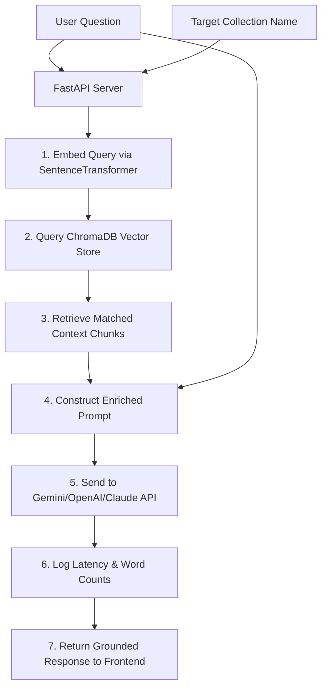

# Data Flow Architecture

This document tracks how data flows through the LLM Playground Studio during document processing, search, generation, and evaluation.

---

## 1. Grounded RAG Pipeline Overview

The following diagram tracks the data flow through the Retrieval-Augmented Generation (RAG) pipeline:

---

## 2. Comprehensive Data Lifecycles

### A. Document Upload & Ingestion Lifecycle
1. **Input:** The user uploads a file (`PDF`, `DOCX`, `TXT`, or `MD`) via the UI.
2. **Validation:** FastAPI validates the file type using extension matching (`backend/utils/file_utils.py`). Invalid extensions raise a `400 Bad Request` error.
3. **Parsing:** The loader (`DocumentLoader`) reads the file. For PDFs, `PdfReader` extracts page text. For DOCX files, paragraph blocks are read.
4. **Metadata Indexing:** `DocumentManager` generates a unique `doc_id` and saves the file to `backend/data/uploads/`. It adds an entry with the file name, size, page count, and upload timestamp to the `_index.json` registry file.

### B. Text Chunking & Embedding Lifecycle
1. **Splitting strategy:** The user passes text to `/api/chunking/preview` choosing one of three strategies:
   - **Fixed Size Chunker:** Splits text based on character index or GPT `cl100k_base` tokens, using a configurable overlap window.
   - **Semantic Chunker:** Tokenizes sentences, creates vector embeddings for each sentence, calculates similarity distances between adjacent sentences, and splits text when similarity falls below a threshold.
   - **Hierarchical Chunker:** Creates larger parent chunks and nests smaller child chunks inside them to preserve broad context.
2. **Vectorization:** Text chunks are sent to the embedding pipeline (`EmbeddingPipeline`), which generates a 384-dimensional vector for each chunk using the local `all-MiniLM-L6-v2` Hugging Face model.
3. **Database Insertion:** The vectors are stored in ChromaDB, mapped to their chunk IDs and metadata.

### C. Search & Retrieval Lifecycle
The search explorer provides three indexing routes:
- **Lexical Search (BM25):** The system lowercases and tokenizes the query into keywords using regex, calculates BM25 term frequency scores, and ranks documents.
- **Semantic Search (ChromaDB):** The system generates a vector embedding for the query using `SentenceTransformer`, queries ChromaDB, and returns matches ranked by Cosine Similarity (`1.0 - Cosine Distance`).
- **Hybrid Search (Reciprocal Rank Fusion):** The system runs BM25 and ChromaDB searches in parallel, fuses their positions using the formula:
  $$\text{RRF Score} = \sum_{m \in M} \frac{1}{60 + \text{Rank}_m(d)}$$
  The top results are returned to the client.

### D. LLM Inference & Caching Lifecycle
1. **Prompt building:** System instructions, matching chunks, and the user's question are formatted into a structured prompt template (`PromptBuilder`).
2. **LLM execution:** The structured prompt is sent to the selected provider (Gemini, OpenAI, Claude).
3. **Streaming:** *Not implemented in the current repository.* Responses are returned as a single JSON payload.
4. **Logging:** Request parameters, responses, latency metrics, and success flags are recorded in the in-memory log list (`run_history`) for telemetry analysis.

### E. RAG Evaluation Lifecycle
When a generated answer is submitted for evaluation, the evaluator (`RagEvaluator`) queries three separate LLM judge models:
- **Faithfulness Judge:** Compares the generated answer to the retrieved contexts to check if all claims are supported by the facts.
- **Answer Relevancy Judge:** Compares the generated answer to the original question to check if it answers the question directly without noise.
- **Context Recall Judge:** Compares the retrieved contexts to the original question to verify if the necessary information was retrieved.
Each judge returns a float score between `0.0` and `1.0`.
