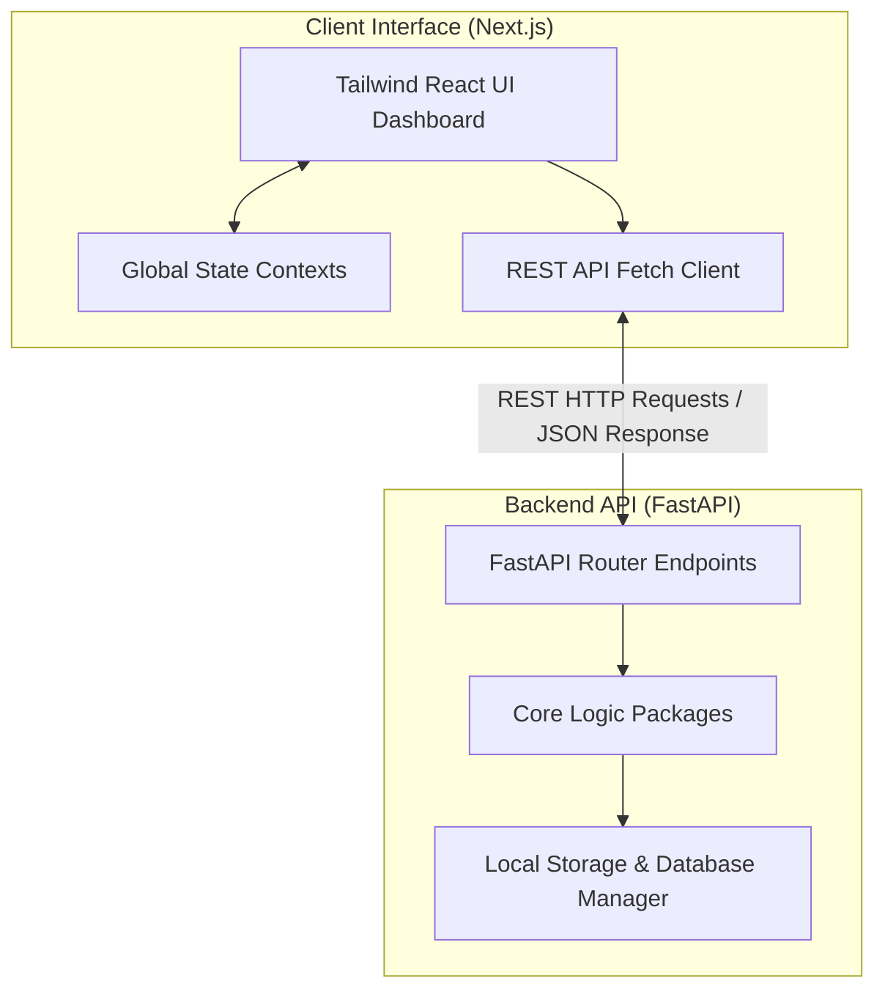
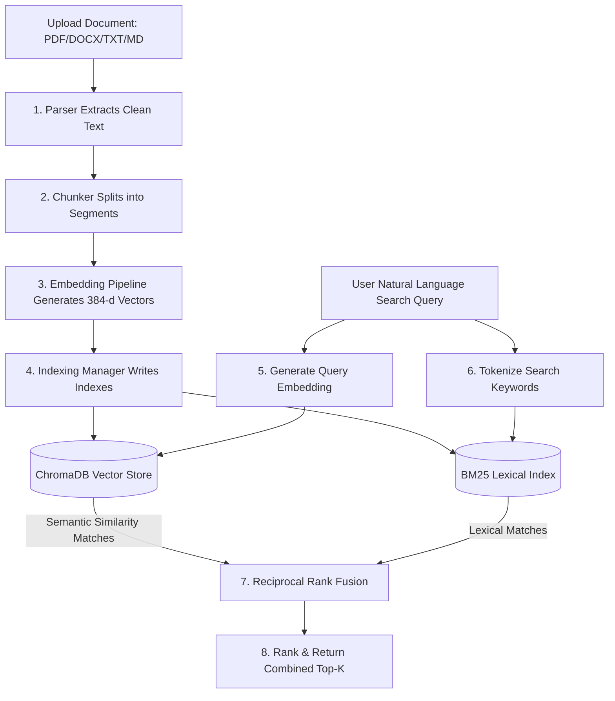
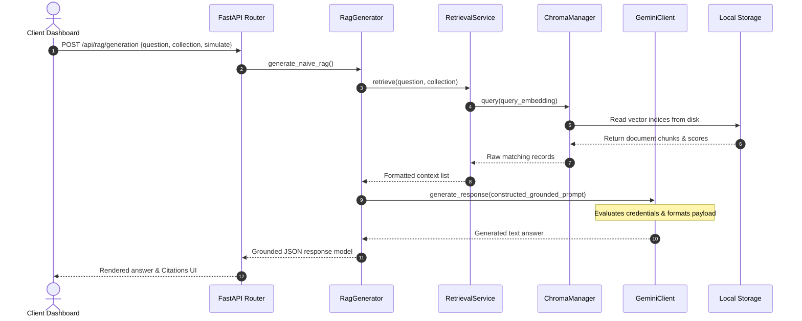
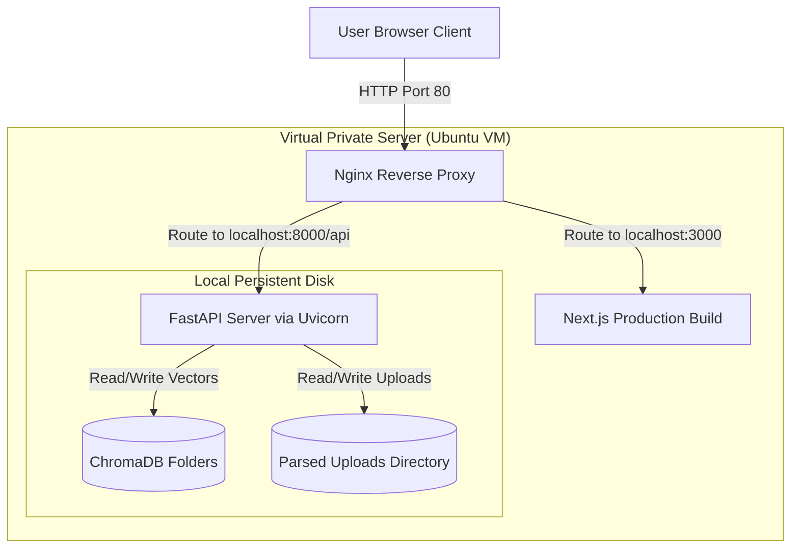
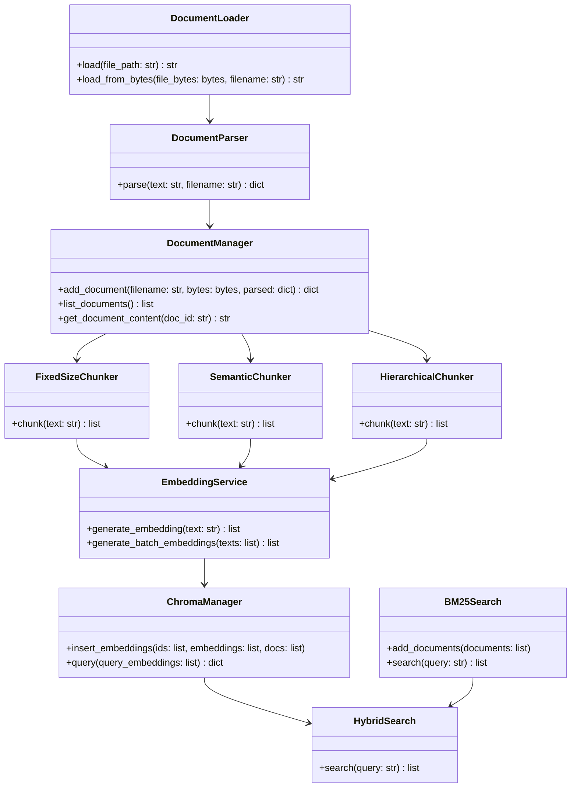

# Architecture & Workflow Diagrams

This directory contains the Mermaid source code and explanations for the primary diagrams of **LLM Playground Studio**. Since PNG generation is not possible in this terminal environment, use these Mermaid definitions to render the diagrams using tools like [Mermaid Live Editor](https://mermaid.live) or a Markdown preview extension.

---

## 1. High-Level Architecture (`architecture.png`)
Shows the decoupled structure between the React frontend and the FastAPI backend service.



---

## 2. Ingestion & Retrieval Dataflow (`dataflow.png`)
Traces the flow of data through document parsing, chunking, indexing, and retrieval.



---

## 3. RAG Grounded Generation Sequence (`sequence.png`)
Illustrates the chronological sequence of requests and responses when executing a grounded RAG generation query.



---

## 4. Server Deployment Diagram (`deployment.png`)
Shows the recommended production hosting structure with Nginx routing traffic to the frontend and backend services.



---

## 5. Folder Structure Diagram (`folder_structure.png`)
Visualizes the layout of folders and files in the repository.

```
LLM-Playground-Studio/
├── backend/                       # Python Backend Service
│   ├── api/                       # Modular FastAPI Routes
│   ├── config/                    # Logging, constants, and API key environment configurations
│   ├── core/                      # Core ML engines and pipelines
│   │   ├── chunking/              # Text splitting strategies (fixed, semantic, hierarchical)
│   │   ├── documents/             # Document parsing, loading, and metadata tracking
│   │   ├── embeddings/            # SentenceTransformer embeddings and distance metrics
│   │   ├── llm/                   # Multi-provider client interfaces (Gemini, Claude, GPT)
│   │   ├── prompting/             # Prompt engineering strategies (Zero-Shot, Few-Shot, CoT)
│   │   ├── rag/                   # Retrieval-Augmented Generation, HyDE, Multi-Query, and Eval
│   │   ├── search/                # BM25 Lexical search and RRF fusion ranking
│   │   └── vectordb/              # ChromaDB index collection handlers
│   ├── data/                      # Local raw storage and parsed uploads
│   ├── models/                    # Pydantic schemas validating payload contracts
│   ├── services/                  # Business logic wrapper services
│   ├── tests/                     # Pytest testing suites
│   ├── utils/                     # Timer decorators, text normalizers, and console loggers
│   └── main.py                    # Server startup file registering routers & global states
├── frontend/                      # React Next.js App
│   ├── src/
│   │   ├── app/                   # App Router views & dashboard pages
│   │   ├── components/            # Shared UI components (Charts, Tables, Modals)
│   │   ├── context/               # Global states (Theme, Simulation Mode toggle)
│   │   ├── services/              # HTTP client API wrappers
│   │   └── styles/                # CSS Style Sheets
```

---

## 6. Component Interaction Diagram (`component_diagram.png`)
Shows the connections between the backend classes and managers.


