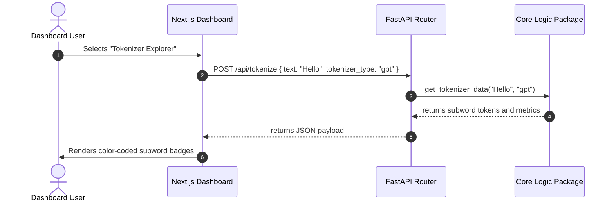

# Project Execution Flow

This document details the operational workflow, initialization lifecycle, and interactions between the frontend client dashboard and the backend API server.

---

## 1. System Startup Lifecycle

### Backend Server Startup
1. The developer executes `python main.py` inside the `backend/` workspace directory.
2. `uvicorn` boots and loads the FastAPI `app` object from `main.py`.
3. The server environment loads variables from `backend/.env`.
4. The server instantiates global singleton services:
   - `EmbeddingService` loads the local Hugging Face `all-MiniLM-L6-v2` model into CPU memory.
   - `ChromaManager` connects to the local sqlite database folder (`backend/chroma_db_api`).
   - `BM25Search` registers lexical search capabilities.
5. The REST API binds to port `8000` on localhost.

### Frontend Application Startup
1. The developer executes `npm run dev` inside the `frontend/` workspace directory.
2. Next.js starts and compiles App Router layouts.
3. State contexts (`ThemeContext` and `SimulationContext`) are initialized.
4. The client UI renders and starts listening on port `3000`.

---

## 2. Frontend-to-Backend Communication

Communication is done through standard JSON REST HTTP requests sent via the browser's `fetch` API.
All frontend components connect to the FastAPI endpoints at `http://localhost:8000/api/*`.

---

## 3. Core Journeys

### A. The User Journey
1. **Explore Tokenizers:** Paste arbitrary strings to compare Hugging Face subword partition counts (BPE, WordPiece, SentencePiece) alongside vocabulary stats.
2. **Visualize Embeddings:** Input list coordinates, cluster terms using K-Means, and render high-dimensional vectors on 2D scatter plots using PCA or t-SNE.
3. **Manage Documents:** Upload PDF, DOCX, TXT, or MD documents, monitor parsing outputs, page numbers, and total characters.
4. **Compare Retrievers:** Benchmarks Naive vector retrievers against BM25 keyword matching, hybrid fusion indexes, HyDE, and Multi-Query expansions.
5. **Grounded Generation:** Execute prompts within the RAG playground. Monitor LLM judge metrics (Faithfulness, Relevancy, Recall) and view matching source cards.

### B. The Developer Journey
1. **Toggle Simulation Mode:** Toggle Simulation Mode in the sidebar footer to mock API responses and save LLM token quotas.
2. **Create Database Collections:** Open the ChromaDB index view to create, inspect, and delete collections.
3. **Execute Unit/Integration Tests:** Run testing scripts (`test_chroma.py`, `test_similarity.py`, etc.) to verify search configurations.

---

## 4. LLM Generation Lifecycle
1. The user enters a question.
2. The system checks `Simulation Mode`:
   - **Simulation Mode Enabled:** The service sleeps for a random latency offset (`0.4s` to `1.8s`) and returns predefined template strings.
   - **Simulation Mode Disabled:** The client instantiates official API SDKs (Google GenAI, OpenAI, Anthropic) using keys loaded from the environment:
     - `GEMINI_API_KEY` (`AQ.` keys)
     - `OPENAI_API_KEY` (`sk-proj-` keys)
     - `ANTHROPIC_API_KEY` (`sk-ant-` keys)
3. The server calls the provider endpoint, monitors latency, calculates generated word counts, and registers telemetry in the run history logs.

---

## 5. System Capabilities & Missing Features

### Streaming Response
- **Status:** *Not implemented in the current repository.*
- **Details:** The backend resolves all requests synchronously and returns complete JSON response payloads rather than HTTP chunks.
- **Recommended improvement:** Add server-sent events (SSE) via FastAPI's `StreamingResponse` to support real-time token generation in the Chat Playground.

### Error Handling Flow
- If a service fails (e.g. invalid key or network issue), the backend catches the error and tries a fallback:
  - For example, if the Google GenAI SDK fails, `GeminiClient` tries a direct HTTP POST requests with the API key in the `x-goog-api-key` header.
  - If both fail, it returns an HTTP `500 Internal Server Error` with details, which the frontend displays to the user.
