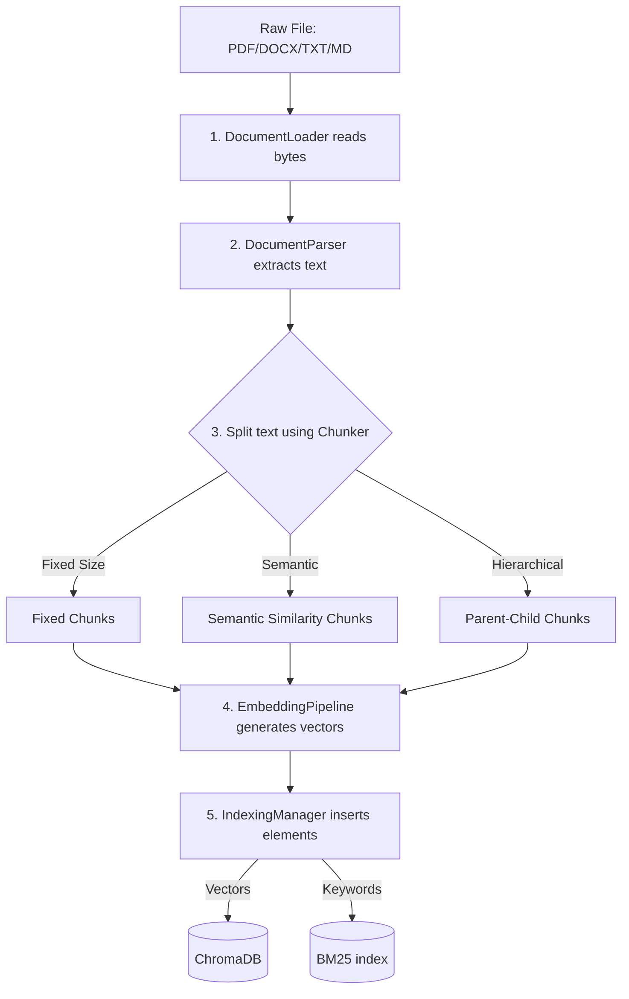
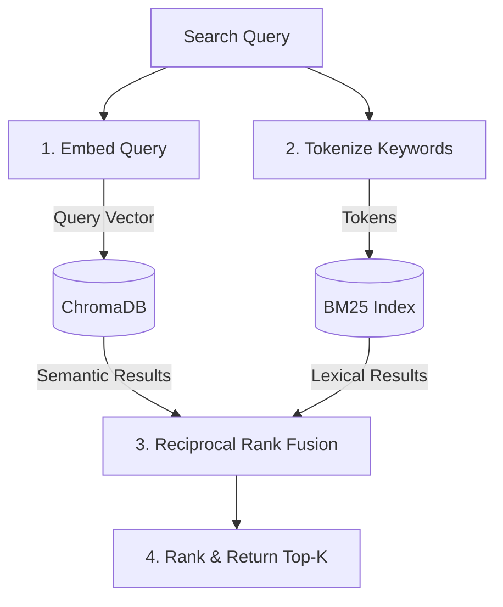

# Retrieval & Ingestion Architecture

This document details the ingestion pipeline, text chunking strategies, vector database configurations, and retrieval comparison mechanisms implemented in **LLM Playground Studio**.

---

## 1. Document Ingestion Pipeline

The ingestion pipeline converts raw files into searchable database entries:

---

## 2. Ingestion Details

### A. Document Loaders & Parsers (`backend/core/documents/`)
- **`loader.py`:** Extracts raw text from uploads. Supports `.pdf` (using `PdfReader`), `.docx` (using `docx.Document`), and `.txt`/`.md` files.
- **`parser.py`:** Standardizes text formatting, extracts clean page structures, and calculates document statistics (such as word and character counts).
- **`metadata.py`:** Saves uploaded files to disk (`backend/data/uploads/`) and records file stats in `_index.json`.

### B. Chunking Explorer (`backend/core/chunking/`)
- **Fixed-Size Chunking (`fixed.py`):** Splits text into uniform chunks based on characters or GPT tokens (`cl100k_base` encoding). Overlap size is configurable to prevent loss of context at boundaries.
- **Semantic Chunking (`semantic.py`):** Splits text by analyzing semantic transitions. It breaks text into sentences, embeds them, calculates cosine distances between adjacent sentences, and splits where semantic similarity falls below a threshold.
- **Hierarchical Chunking (`hierarchical.py`):** Creates larger parent chunks and nests smaller child chunks inside them to preserve broad context.

---

## 3. Search & Database Indices

The system uses a hybrid search index:

### A. Vector Database (`backend/core/vectordb/`)
- **`chroma_manager.py`:** Manages a local, disk-based vector database (`chromadb`). It uses **Cosine Similarity** (`hnsw:space = cosine`) to rank and retrieve matching document chunks.

### B. Traditional Lexical Search (`backend/core/search/`)
- **`bm25_search.py`:** Indexes documents using the **BM25 Okapi** algorithm. It lowercases and tokenizes text, calculates keyword frequencies, and retrieves matching documents.

### C. Hybrid Search & Fusion (`backend/core/search/`)
- **`hybrid_search.py`:** Combines results from both search engines. Because lexical and semantic search scores use different ranges, the system fuses results using the **Reciprocal Rank Fusion (RRF)** formula:
  $$\text{RRF Score} = \frac{1}{60 + \text{Rank}_{\text{BM25}}} + \frac{1}{60 + \text{Rank}_{\text{Chroma}}}$$
  The combined results are re-sorted and returned.

---

## 4. Advanced Retrieval Strategies (`backend/core/rag/retrieval_comparison.py`)

The **Retrieval Comparison** view lets users benchmark four retrieval strategies side-by-side:

### A. Naive Retrieval
A standard semantic vector search that queries ChromaDB using the query's embedding vector.

### B. Hybrid Retrieval
Runs vector search and BM25 search in parallel, merging results using RRF.

### C. Hypothetical Document Embeddings (HyDE)
Uses the LLM to write a hypothetical answer to the user's question, embeds this hypothetical answer, and uses the resulting vector to query the database. This helps bridge the semantic gap between questions and answers.

### D. Multi-Query Expansion
Uses the LLM to generate three alternative search queries. The system runs searches for all queries, combines the results, and returns the top matches based on maximum similarity scores.

---

## 5. System Limits & Recommended Enhancements

### Re-ranking (Cross-Encoder / Cohere)
- **Status:** *Not implemented in the current repository.*
- **Details:** The retrieval pipeline returns the fused results directly. It does not run a second pass to re-score matching chunks using a re-ranking model (such as a Cross-Encoder or the Cohere Re-rank API).
- **Recommended improvement:** Add a local cross-encoder model to re-score the top 10 retrieved chunks for improved relevance.
